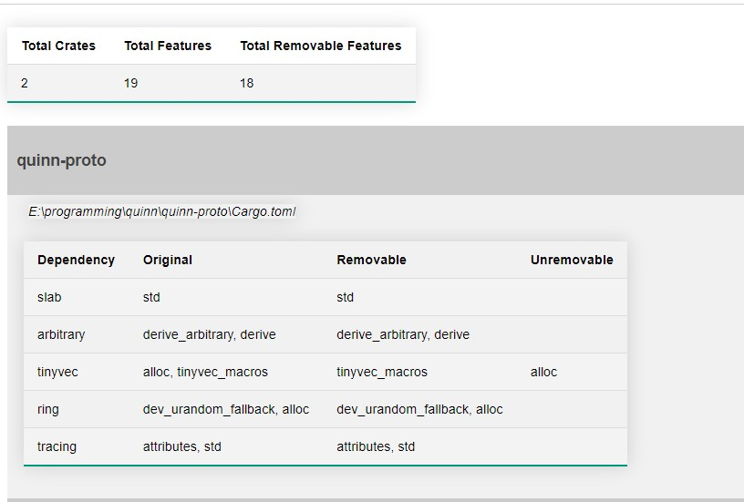

<h1 align="center"></h1>

<div align="center">

[](https://www.paypal.com/cgi-bin/webscr?cmd=_s-xclick&hosted_button_id=Z8QK6XU749JB2) [![Latest Version][1a]][1b] [![MIT][2a]][2b] [![docs][3a]][3b]

</div>

# Potential unused, enabled feature flag finder and pruner.

This cargo tool allows you to find and prune enabled, but, [potentially](#3-some-things-to-keep-in-mind) unused feature flags from your project.

Use `cargo unused-features --help` to fetch more details about available subcommands and their configurations.

# 1. How to use

Run `cargo install cargo-unused-features` or download the library and build it yourself.

1. Step Analyzing enabled unused features.

*You can control the compilation by supplying `--bin, --lib, --examples, --benches, --tests` flags. By default, libraries and binaries are compiled. If you want tests, examples, benches, be compiled in the analysis, make sure to supply the corresponding tags.*

```bash
cd C:/some_path/
cargo unused-features analyze
```

After it finished running, check the `report.json` in the project directory and use this for the next two steps.

2. Generating a HTML report. (optional)

You can generate a simple HTML report from the json to make it easier to inspect results. 



```bash
cargo unused-features build-report --input "C:/some_path/report.json"
```

After it finished running, check the `report.html` in the project directory. You can choose to manually fix your dependencies or use the command in the next step.

3. Applying suggested removals of feature flags.

It is possible to auto-apply the findings of the first command. But keep in mind the [disclaimers](#3-some-things-to-keep-in-mind).

```bash
cargo unused-features prune --input "C:/some_path/report.json"
```

# 2. How it Works

This library works for both workspaces and individual crates. In the context of a workspace it will just iterate each crate in the workspace-definition and run the same process it does for a single crate. 

For a single crate it removes a feature of a dependency and then compiles the project to see if it still compiles. If it does, the feature flag can possibly be removed, but it can be a false-positve ([disclaimers](#3-some-things-to-keep-in-mind).). Yes, recompiling for every feature-flag implies some overhead. However, this is a one-time thing and if you have a large project, just let it run for a while. I personally have ran it on a project with over 50 crates and it finished within an hour. The compiler will not perform a complete clean rebuild which is in our favor.

Furthermore, This library uses [cargo_toml][6] to remove or add features. It loads a TOML file into memory, modifies the dependency features, serializes the `Manifest`, and writes it back to the toml-file. Then it starts compiling, and after it finishes running, the original content is written back as if nothing had happened.

But before doing all of that, we need to know which features to remove in the first case. This library uses [cargo-metadata][7] to collect all enabled features from the dependencies. Features can be enabled in several ways. Manually by `features = ['x', 'y']` tag, or by the `default-features=false/true` tag. Also, features can enable 0-n other features e.g `default=[x,y]`. So, this library collects all enabled features, whether they are implicitly or explicitly enabled. After it collects all enabled features for a dependency, it will remove them one-by-one and compile the project as described above.

During the process, a json report is updated for each crate to ensure that if it crashes the progress is not lost. Use the `cargo unused-features build-report` command to visualize this report.

Finally, this library also has the option to apply all suggestions automatically by running `cargo unused-features prune` command. For this task, [toml-edit][8] is used because it doesn't mess with formatting, comments, and spaces, in the TOML-file.

# 3. Some things to keep in mind

- Sometimes feature flags can turn logic on and off without breaking the compilation and therefore this tool can mark a feature flag as removable, but essentially it would change the internal logic of a library. For this reason, this library offers 3 phases. Analyze, automatically apply suggestions, and generate a report. If you want to be more carefully inspect the HTML report to see more clearly what suggestions are given and manually update the dependencies yourself. 
- Given crate A and B, B depends on A and uses logic from a dependency of A that is hidden behind a feature flag enabled in A, but A itself does not use this code. In this scenario, the feature flag can be removed for A but not for B. So this can result in a false positive. I would recommend going through the suggestions on a crate by crate basis, or just running it on the full workspace, and fixing the compilation errors by adding the removed features. 
- Feature flags may only be used for a certain target-os. This project does not compile for each target, but instead, you can specify the target with `--target x` to the `cargo unused-features` command.

# 4. Report Bug

This tool is very new, and one can expect problems. If you have problems, please do the following:

1. Open an issue with the problematic `Cargo.toml` file. 
2. Provide the `--log debug` flag to the `cargo-unused-features` command and post the logs in the issue as well.

# Future

Would be nice to find ways to be more certain about when a feature can be removed. Potentially we would need to do some regex matches with features in the dependency code base and see how the feature is used. And with that get a more precise assumption. If you have an idea, feel free to open an issue or reach out to me!

[1a]: https://img.shields.io/crates/v/cargo-unused-features.svg
[1b]: https://img.shields.io/crates/v/cargo-unused-features.svg
[2a]: https://img.shields.io/badge/license-MIT-blue.svg
[2b]: ./LICENSE
[3a]: https://docs.rs/cargo-unused-features/badge.svg
[3b]: https://docs.rs/cargo-unused-features/
[6]: https://crates.io/crates/cargo_toml
[7]: https://crates.io/crates/cargo_metadata
[8]: https://crates.io/crates/toml_edit
